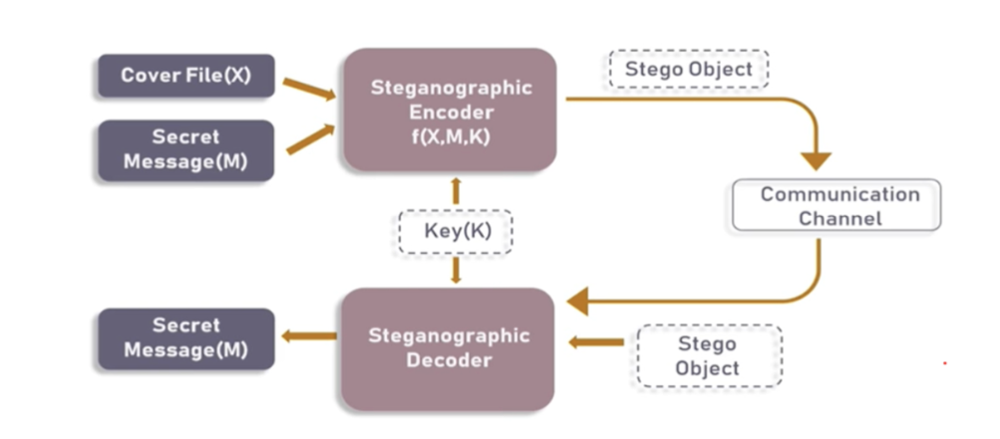

# Text-Hiding-in-digital-image-processing-using-Steganography

## Table of Content

 1. Overview
 3. Motivation
 5. Technical-aspect
 6. Technologies-used

### Overview

Steganography is the art of hiding secret data in any file.
The secret data can be data of any format like text or even a file. In a nutshell, the main motive of steganography is to hide the intended information within any file, usually an image, audio, or video, without actually changing the external appearance of the file, i.e. it should look the same as before.

### Motivation 

Now a days Data privacy and data security are always on highest priority in the world. We need a reliable method to encrypt the data so that it reaches the destination safely. Encryption is a simple yet effective way to protect our data while transmitting it to a destination. The proposed method in this project has state of art technology of steganography and encryption. 

### Technologies Used  
 

[

### Workflow 

In this project, we will be focussing on image-based steganography, i.e hiding secret data in an image. But before diving a little deeper into it, let’s look at what an image comprises of.
1. Pixels are the building blocks of an image.
2. Every pixel contains three values: (red, green, blue) also known as RGB values.
3. Every RGB value ranges from 0 to 255.

### Algorithm

#### Part 1) Encoding :-

There are a lot of algorithms that can be used to encode data into the image, and in fact, you can also make one yourself. The one being used in this blog is easy to understand and implement, as well.

Step 1:- For each character in the data, its ASCII value is taken and converted into 8-bit binary [1]. The ASCII value of H     .
is 72, whose binary equivalent is 01001000

Step 2:- Three pixels are read at a time having a total of 3*3=9 RGB values. The first eight RGB values are used to store one character that is converted into an 8-bit binary. Read the first three pixels. (27, 64, 164), (248, 244, 194), (174, 246, 250)

Step 3:- The corresponding RGB value and binary data are compared. If the binary digit is 1 then the RGB value is converted to odd and, otherwise, even.
For example, the first binary digit is 0 and the first RGB value is 27, it needs to be converted to even, which implies 26. Similarly, 64 gets converted to 63because the next binary digit is a1so the RGB value should be made odd. So, the modified pixels are : (26, 63, 164), (248, 243, 194), (174, 246, 250)

Step 4:- The ninth value determines if more pixels should be read or not. If there is more data to be read, i.e. encoded or decoded, then the ninth pixel changes to even. Otherwise, if we want to stop reading pixels further, then make it odd.
Since we have to encode more data, the last value should be even. Similarly, i can be encoded in this image.
While making the pixel values odd/even by doing +1 or -1, you should take care of binary conditions. I.e., the pixel value should be more than or equal to 0 and less than or equal to 255. The new image will look like:
[(26, 63, 164), (248, 243, 194), (174, 246, 250), (148, 95, 231), (188, 155, 168), (70, 167, 126), (132, 173, 97), (112, 69, 206), (254, 29, 213), (53, 153, 220), (246, 225, 229), (142, 82, 175)]

#### Part 2) Decoding :-

For decoding, we shall try to find how to reverse the previous algorithm that we used to encode data.
Step 1:- Again, three pixels are read at a time. The first 8 RGB values give us information about the secret data, and the ninth value tells us whether to move forward or not. Read the first three pixels. (27, 64, 164), (248, 244, 194), (174, 246, 250)

Step 2:- For the first eight values, if the value is odd, then the binary bit is 1, otherwise it is 0. Reading the first value:which is even, therefore the binary bit is Similarly, for 63, the binarybit is 1   164 it is 0 and for 26 This process continues until the eight RGB value.

Step 3:- The bits are concatenated to a string, and with every three pixels, we get a byte of secret data, which means one character 0.
We finally get the binary value: 01001000 after concatenating all individual binary values. The final binary data corresponds to decimal value 72, 
and in ASCII, it represents the character H.

Step 4:- Now, if the ninth value is even then we keep reading pixels three at a time, or otherwise, we stop. Since the ninth value is even, we repeat the above steps. We stop when the ninth value encountered is odd.
As a result, we get our original message back which was Hii.

### Result 

#### Encoded the data into the Image :- 

#### Original and Encrypted Image :- 

#### Decoded the data in the image :-

###  Made with &nbsp;❤️ by  [Karan Shah](https://github.com/karan19100)
